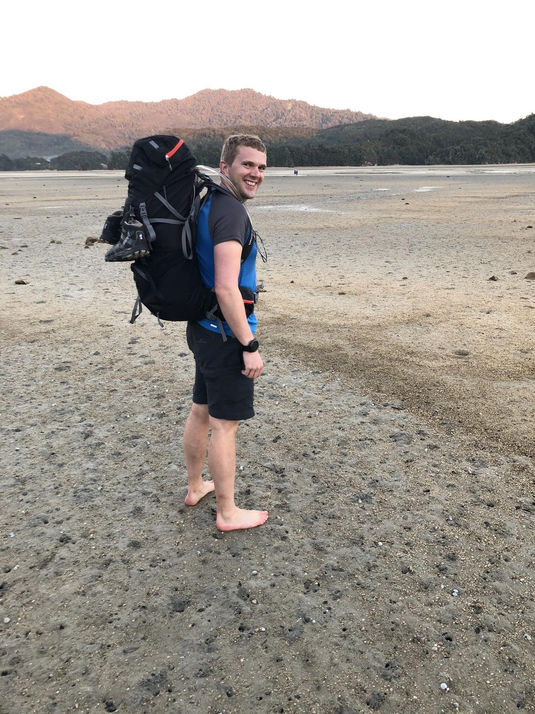

It was an early start this morning as we had to make it across the estuary within 2 hours of low tide (5:20 am).
We were up around 6 and, luckily, were getting more efficient at making breakfast (porridge) and packing our bags ready to leave.
The sign in the hut said that, even at low tide, you should expect to get wet, so we took off our shoes and walked across (~1 km) barefoot.
It wasn't very comfortable as there were lots of sharp stones/shells on the ground.

Next was a nice section walking through forest and then along a couple of stunning beaches.

There was a steep climb up to get across to Totaranui beach and there was a nice viewing point at the top, where we stopped for something to eat.

We got to the beach with a bit of time to spare before the water taxi arrived, so took the opportunity to go for a swim in the sea.
The water taxi stopped off at a couple of sightseeing spots before getting back to Marahau.
After getting some food we were both relieved to get back to our room for a much needed shower and rest.




