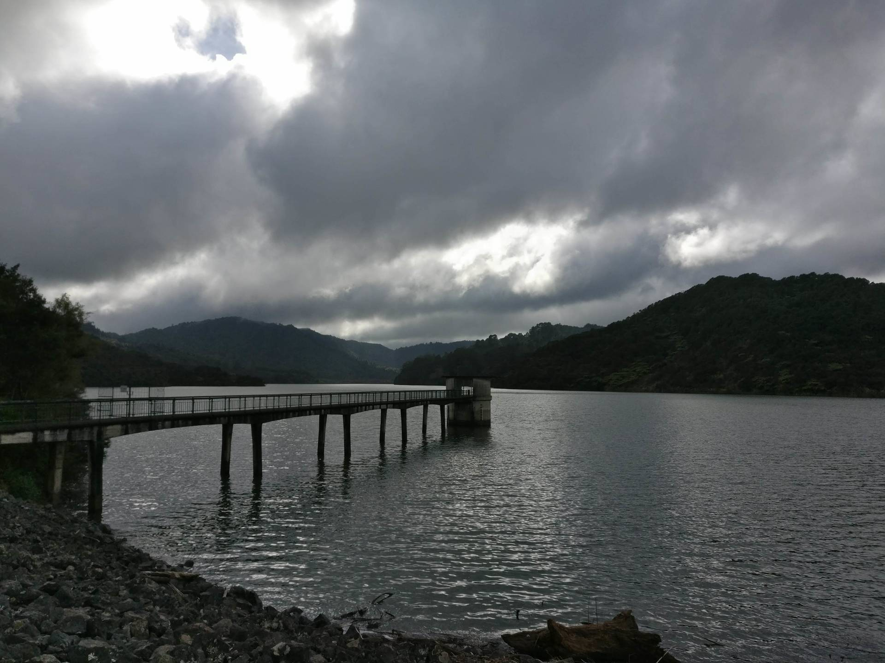
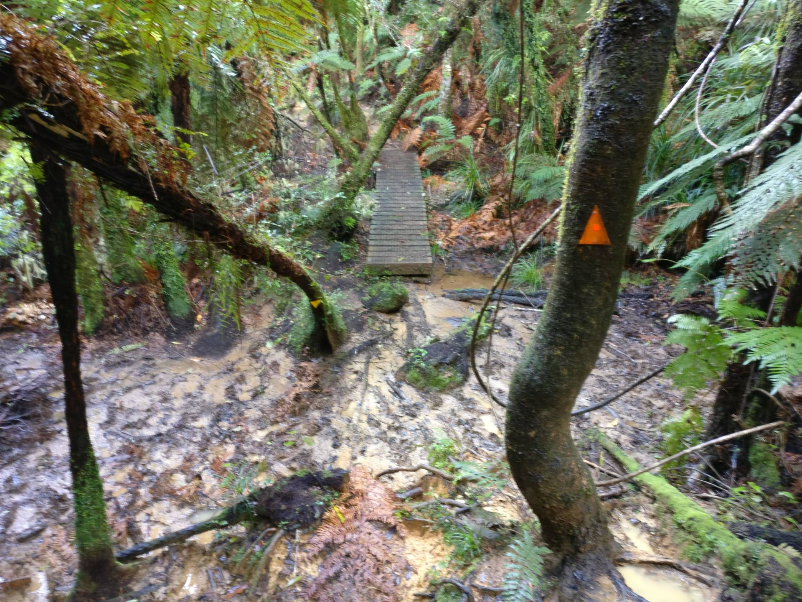
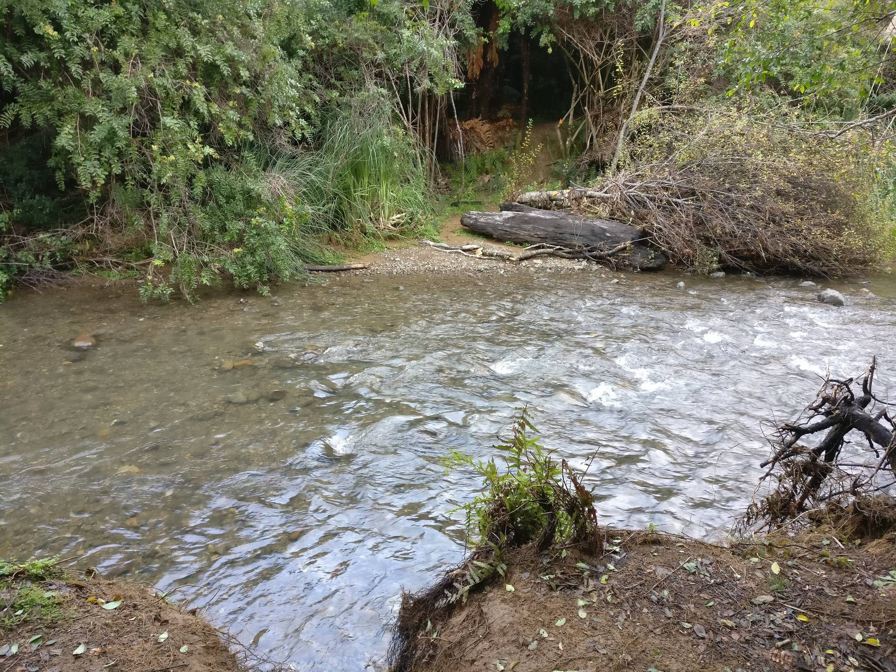
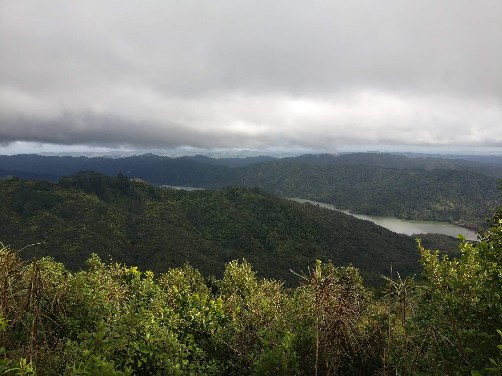
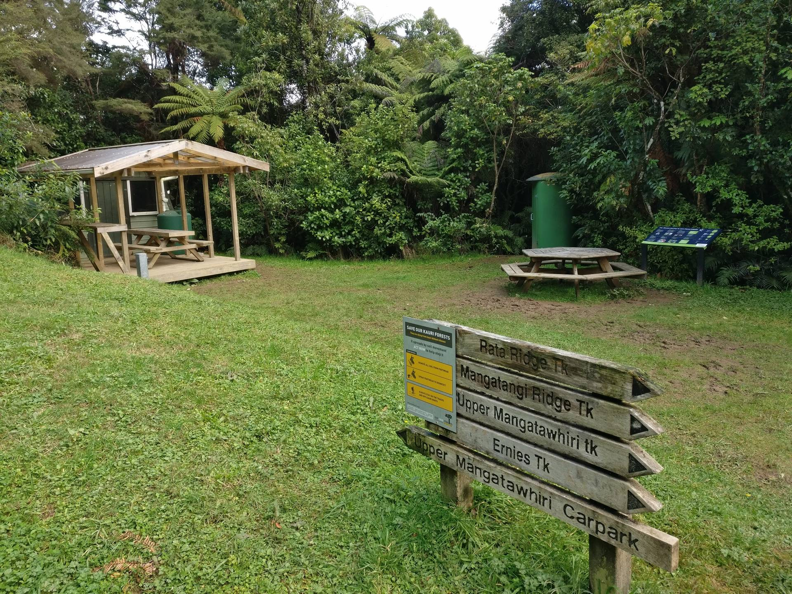
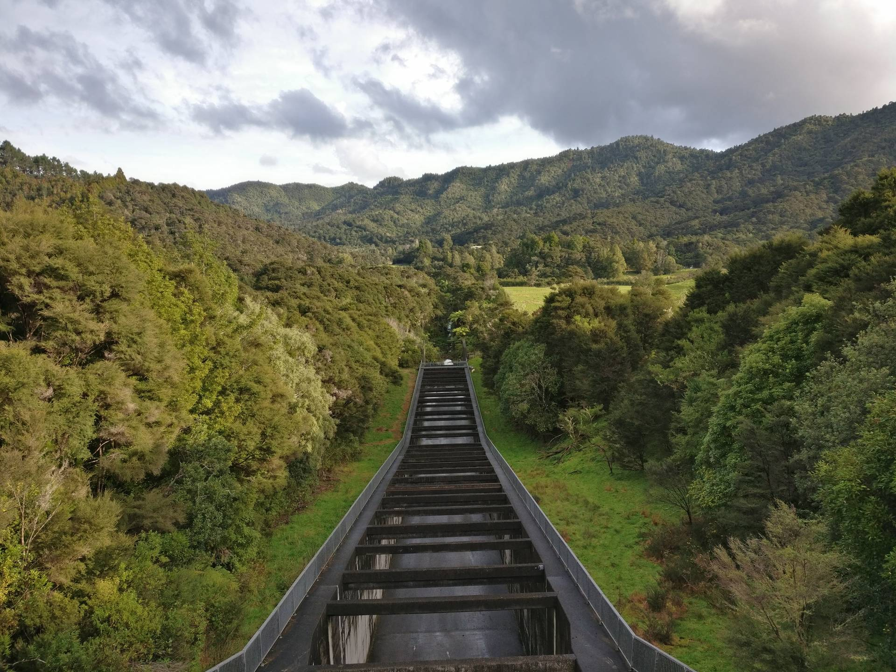

Another set of weekend night shifts for Gemma and another trip to the Hunua Ranges for me.
This time I headed to the Upper Mangatawhiri Reservoir, parking below the dam near the campsite, to do the Ernies Track loop.
I did the loop in a clockwise direction, which I think was a good decision.
This way, most of the downhill was on wide, open track, while the uphill was steep and technical.

After running up to the dam I set off along Waterline Road, a gravel track that was easy to run along.
So easy that I didn't even notice the turn off onto Ernies Track, going a few hundred metres past it before I realised (all uphill of course).
Ernies Track was really good fun, there were lots of muddy/boggy sections to navigate around and lots of slippy roots across the track.
The trail was pretty obvious and there were plenty of trail markers to look out for.
Although the first section of the track was flat, it was slow going and I wasn't running much anymore.

There were also a few stream crossings along the track and one bigger river crossing, where there was no choice but to get your feet wet.

Shortly after the river crossing there was an interesting, short section through a "tunnel" hacked through a bit of bamboo forest (photo below).
The steep climb up began soon afterwards and, eventually, there was a little clearing and seat to admire the view.

Continuing on past Ernies Junction and another nice lookout, the descent back down began at last.
There were quite a lot of steps on the way down but, in general, the surface was much better than on the way up, with some gravel sections of track that meant I could go a bit faster.
There was another junction and then shortly later I arrived a Piggots Campsite, which also had a little shelter.

After the campsite, there was a long, gradual descent back down to the dam, on another gravel track.
I was able to run this last section and it passed really quickly, although might have been a bit repetitive if walking.

I was across the dam and down to the car in just over three hours, almost exactly the same time as the other person who set off at the same time and did the same loop in the opposite direction.
I enjoyed this loop and will hopefully do some more in the area, Kauri Dieback closures permitting.
