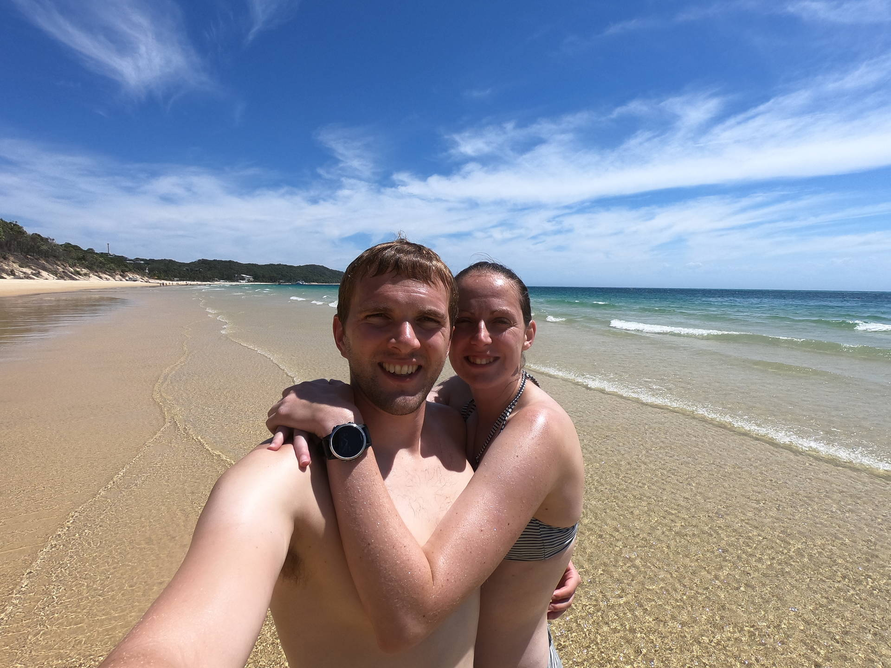
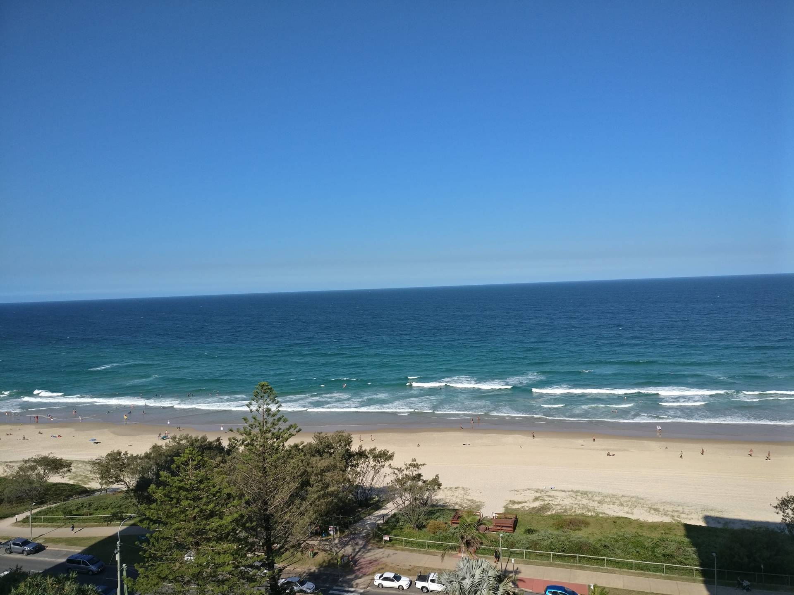

Gemma had to go to Gold Coast for work so we decided to head out together a few days early and have a look around.
We went on a boat trip to Moreton Island and did some snorkelling around some ship wrecks.

The island was stunning and we spent some time on a beautiful beach.
The snorkelling was really cool and we got to see lots of fish and coral around the wrecks (see video below).

Back in Gold Coast we had a great view from the apartment.
We had a good time looking around Gold Coast, although it was very hot and I struggled in the heat; we had to get up early to run!


