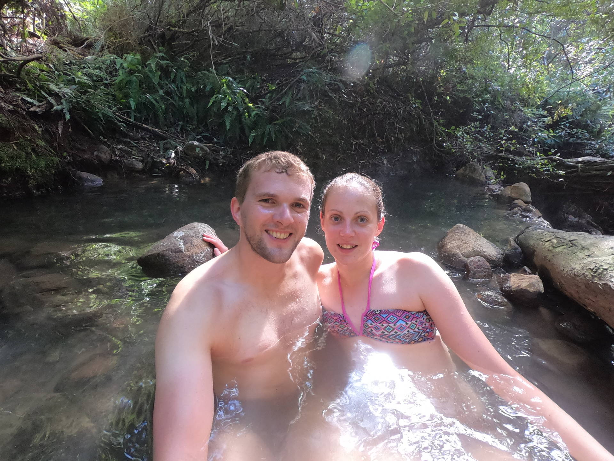
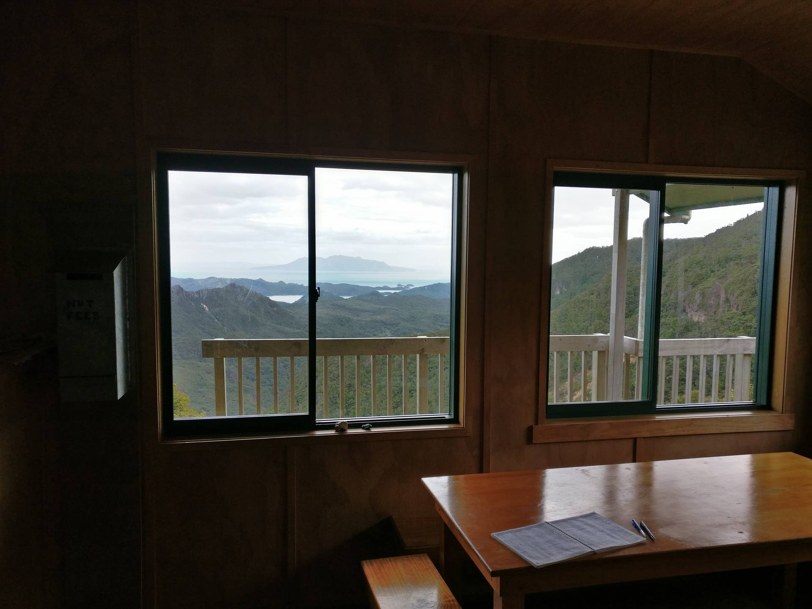
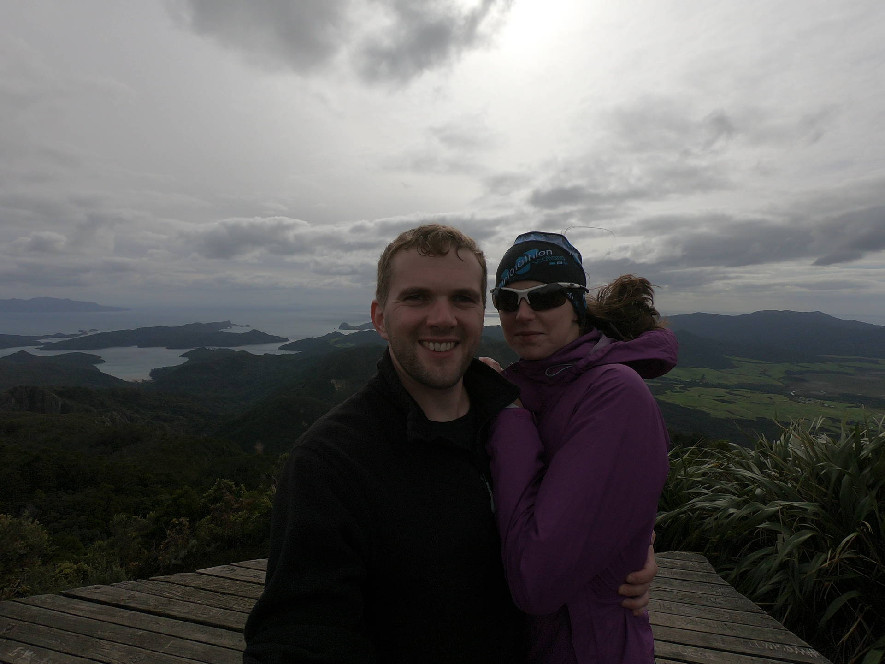

We took advantage of us both having a week off to fly over to Great Barrier Island for a short break.
It was a small plane, with eight seats including the pilot, and looked pretty flimsy.
However we had pretty good weather for the flight across and only got a bit bumpy near the island.

On Great Barrier we set off walking from the airfield towards the Kaitoke Hot Springs.
It was a flat, easy walk to get there and took around 1.5 hours.
The hot springs were great.
They are natural hot pools with a big pool right next to the main path and a few more smaller pools up the side track, which was where we went.

We headed along Tramline track and then up Peach Tree track towards Mt Heale Hut.
As we climbed up we started to get some great views of the forest covered hills and back towards the coastline.
Eventually we reached the hut, which is in a great location at the top of a ridge with a views down to the coast, and had some food.

We decided to leave our heavy packs at the hut for the climb up to the top of Mount Hobson, after reading that there were 1000 steps to get to the top.
The steps were relentless but it was definitely worthwhile when we reached the top.

It was starting to get very windy by this point and we headed back down the steps to the hut.
The facilities at the hut were really good, with gas burners and plenty of lights.
We almost had it to ourselves, with just one other person turning up.
We settled down for the night to howling wind, which was causing the whole hut to shake constantly.


