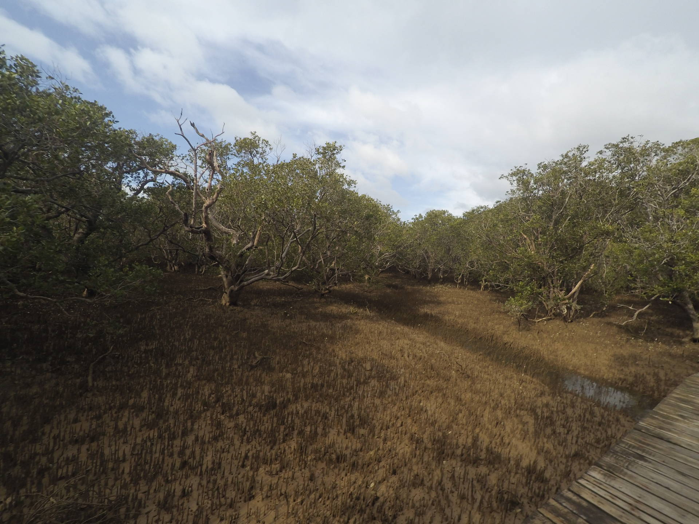
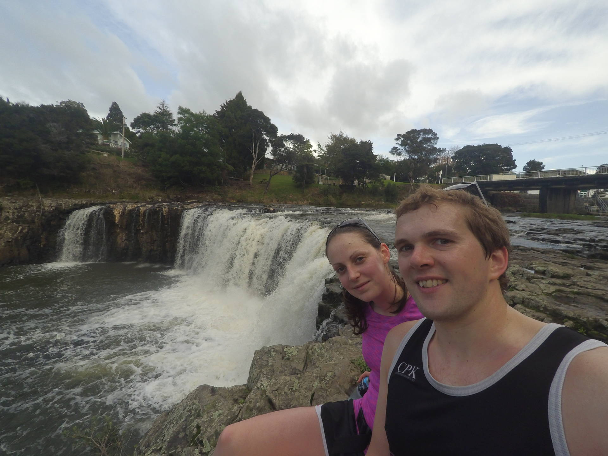
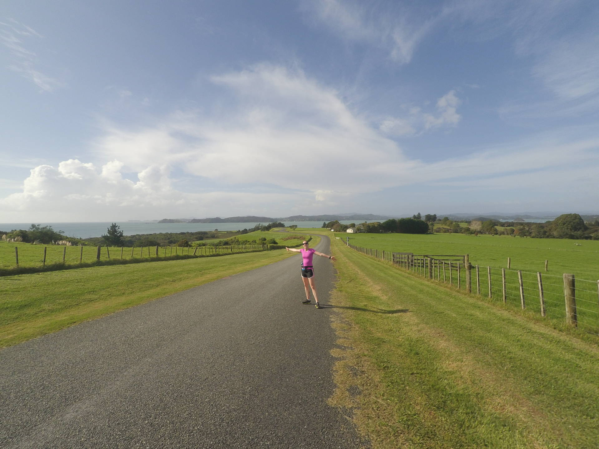

We spent a long weekend in the Bay of Islands for Gemma's birthday and on one day we went for a run to Haruru Falls.

The way out was on really nice trails through a forest and along a river.

At the waterfall we saw some chickens chasing each other around the car park.



After the waterfall we looped around on some gravel roads back to the start.

