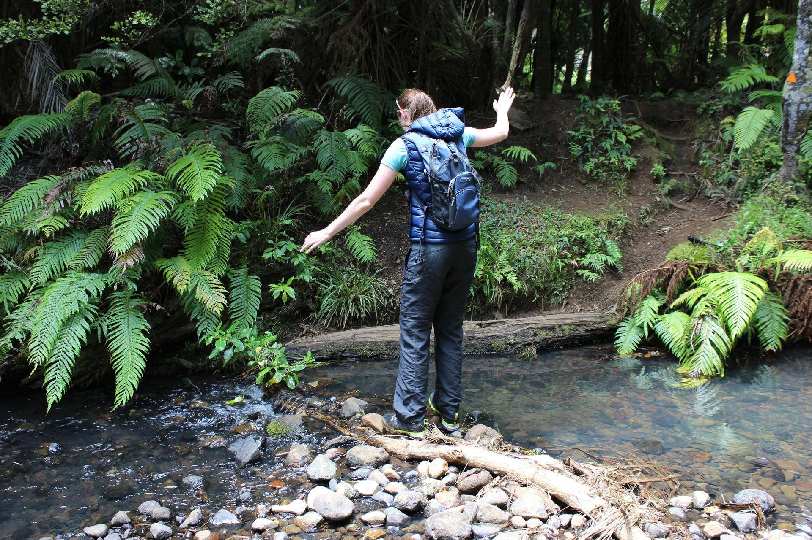
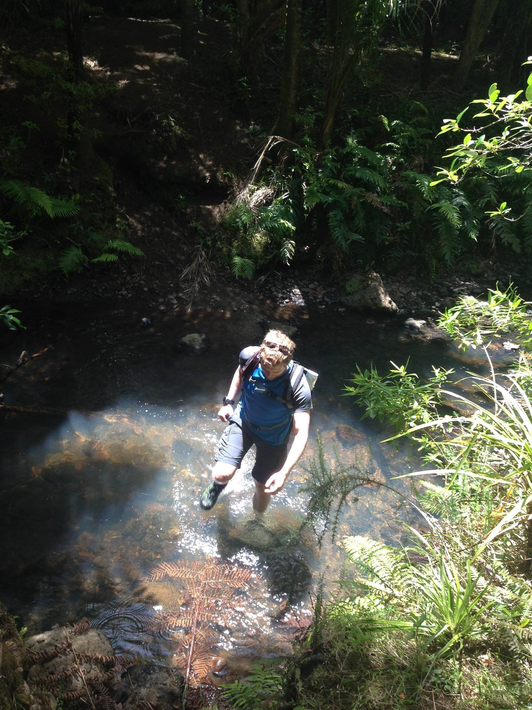
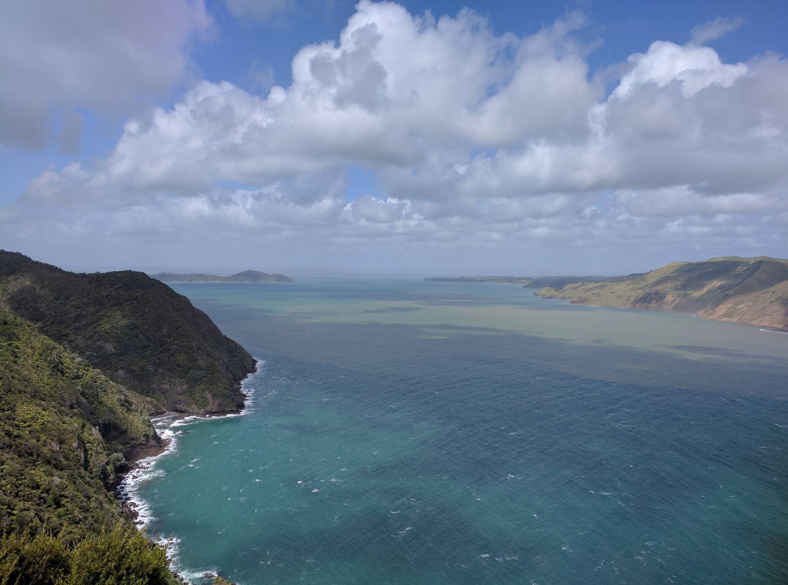
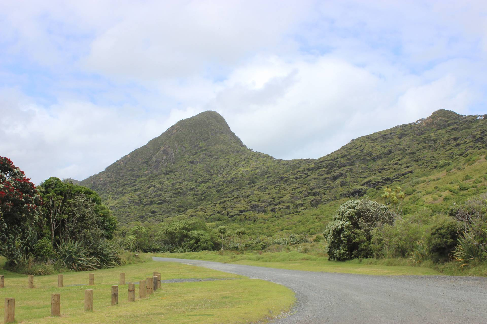

This was a great walk. We had been to Whatipu beach before and really liked it there, so decided
to head back and do a walk. We started from Whatipu and took the
[Kura track](http://regionalparks.aucklandcouncil.govt.nz/whatipu/track/Kura%20Track) first. This
track winds its way up through a forest and involved a few stream crossings. At the first of these
there were stepping stones so we spent time trying to get across without getting our feet wet.

We needn't have bothered as there were three more stream crossing in quick succession, with no
option but to get your feet wet.

We looped back to the start via the
[Omanawanui track](http://regionalparks.aucklandcouncil.govt.nz/whatipu/track/Omanawanui%20Track).
This track was stunning, climbing along a ridge with beautiful views over Manukau Harbour and
Whatipu. There were even a couple of sections with chains to help climb up and down as it
was very steep in places.

---
image: background.jpg
---
gpx: trail.gpx
---
description: Hike
