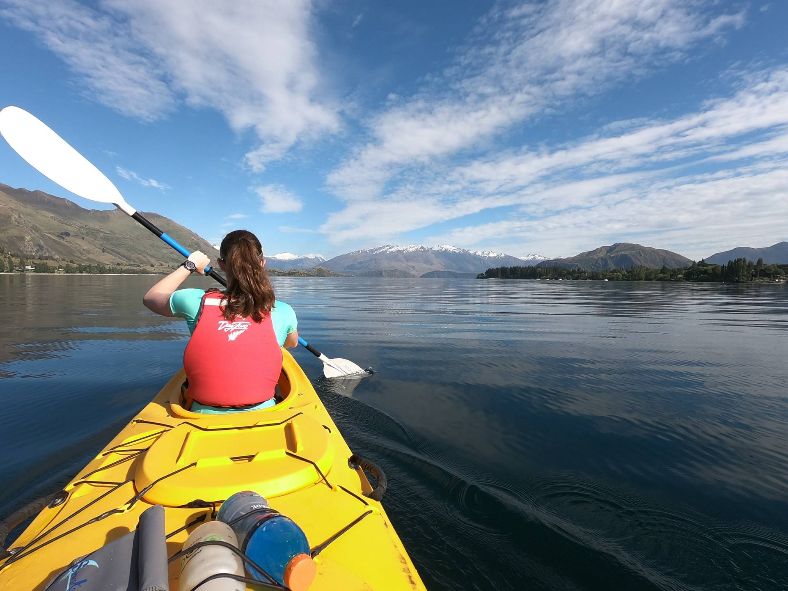
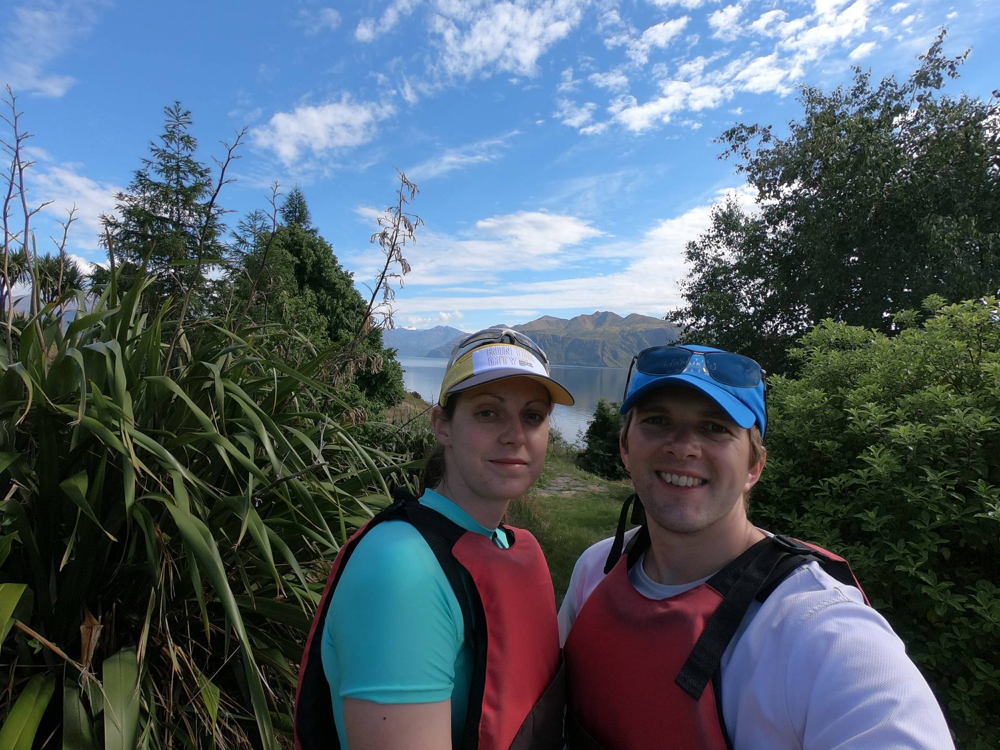
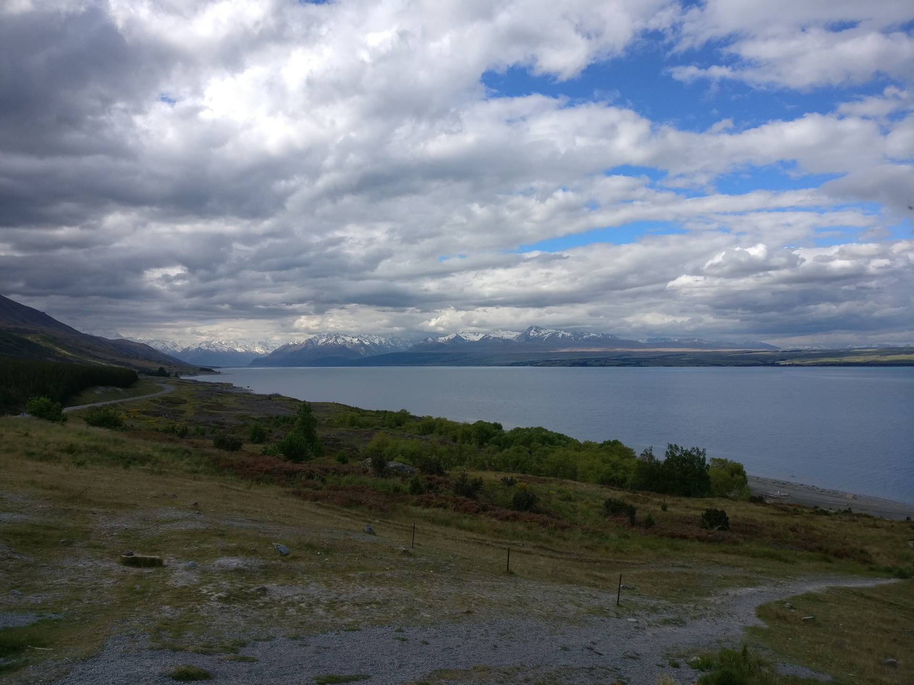
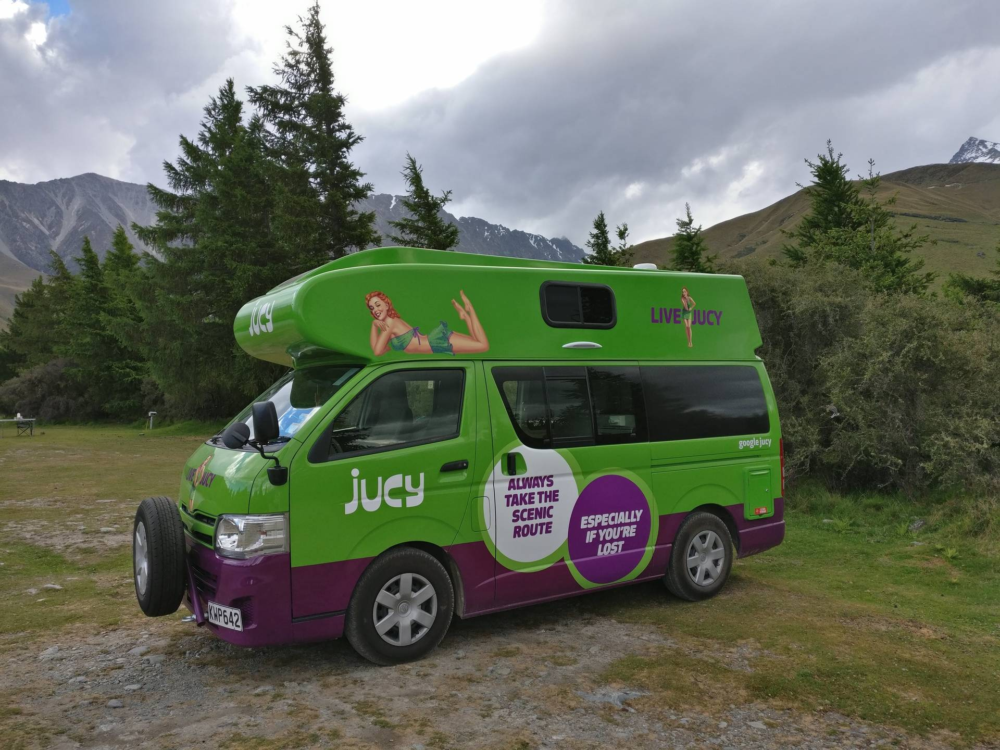

After two big walks in two days our legs were feeling very tired, so we decided to give them a rest and do some kayaking.
We hired a double kayak and set off on a very peaceful and stunning day on Lake Wanaka.

We paddled up the edge of the lake and then cut across to Ruby Island.
We did a full circuit of the island and then landed on a beach and had a look around and walked to the top of the island.

We then paddled across to the other side of the lake and back to the start, throwing in a fast 500m along the way.

After kayaking we met Chris and Martha for a nice lunch in Wanaka - they were travelling from Christchurch to Queenstown, the opposite direction to us.
Following lunch we set off on the drive to [Mount Cook](http://www.doc.govt.nz/parks-and-recreation/places-to-go/canterbury/places/aoraki-mount-cook-national-park/).

The weather was starting to get very cloudy as we drove alongside Lake Pukaki, up the valley towards the Glentanner Holiday Park.


