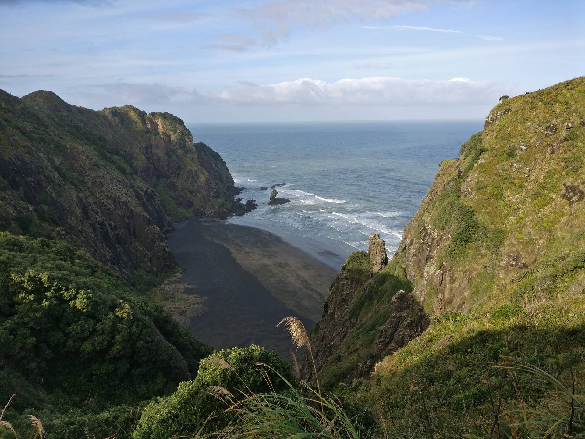

We went for a short walk around the [Mercer Bay Loop](http://regionalparks.aucklandcouncil.govt.nz/karekare/track/Mercer%20Bay%20Loop%20Walk).
We were out for about 1 hour and will definitely go back to do a longer one on part of the Hillary trail, as the area looked stunning.

