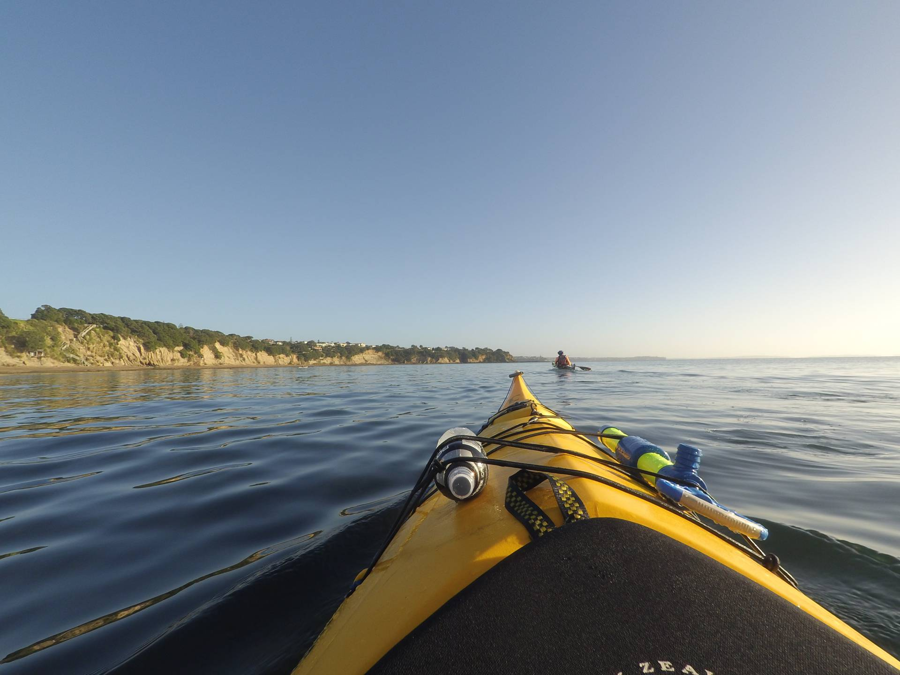

This was the longest kayak I have done so far. We went from the north end of Milford Beach all the way up the coast to Long Bay and back. The weather was perfect, with clear blue skies and the sea was almost flat. The coast was quite impressive in places, with lots of cliffs with houses perched on the edge (they must have some amazing views). There were also lots of slips from the recent bad weather.

