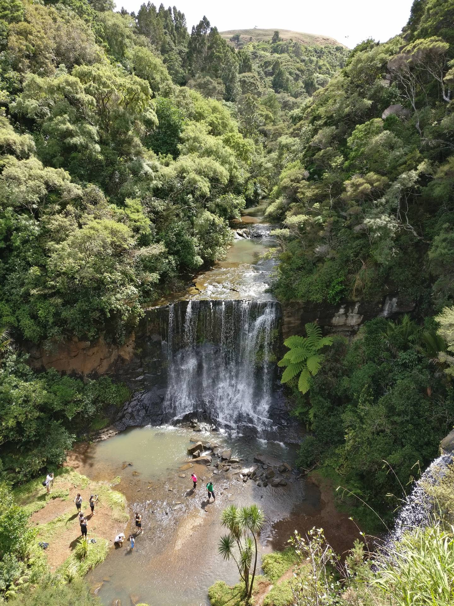
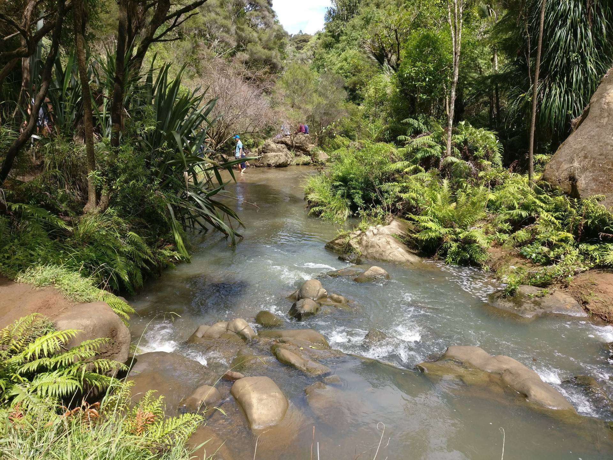

Unusually we both had the day off on a public holiday and we decided to walk to the [Mokoroa Falls](http://www.doc.govt.nz/parks-and-recreation/places-to-go/auckland/places/muriwai-and-te-henga-area/tracks/mokoroa-falls-track/) in the Waitakeres.
It is an easy walk along a good track and the falls are quite impressive.

A short extra walk down some steps takes you to the bottom of the falls.
We managed to keep our feet dry crossing the rocks to get to the viewing point.


