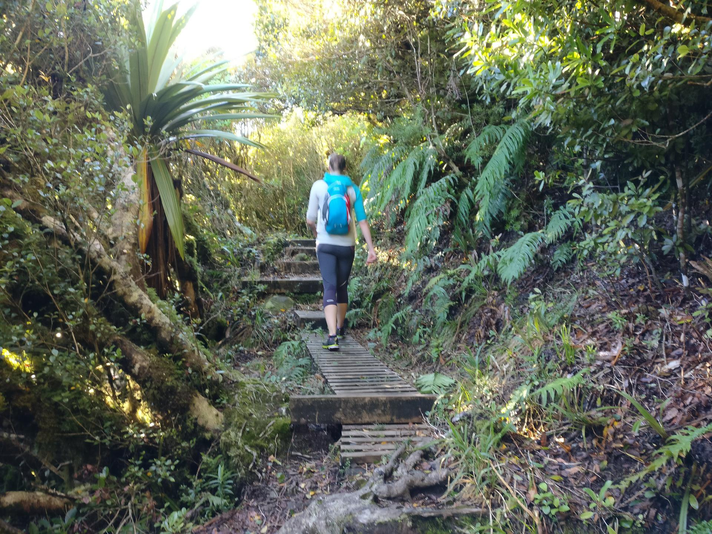
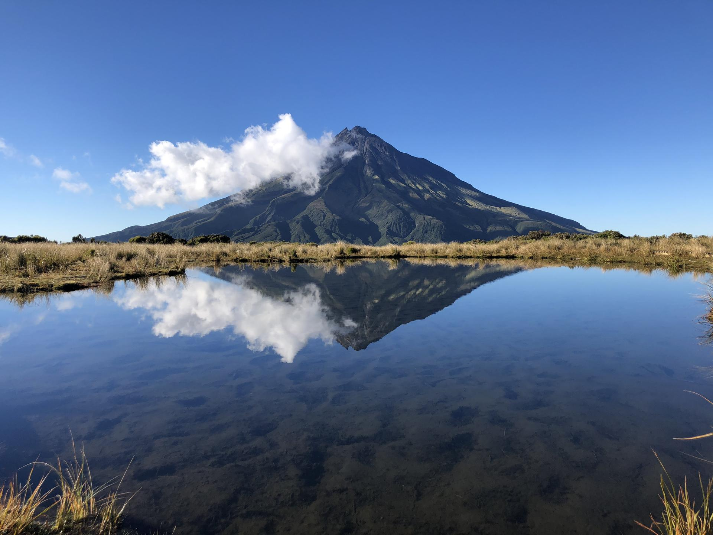
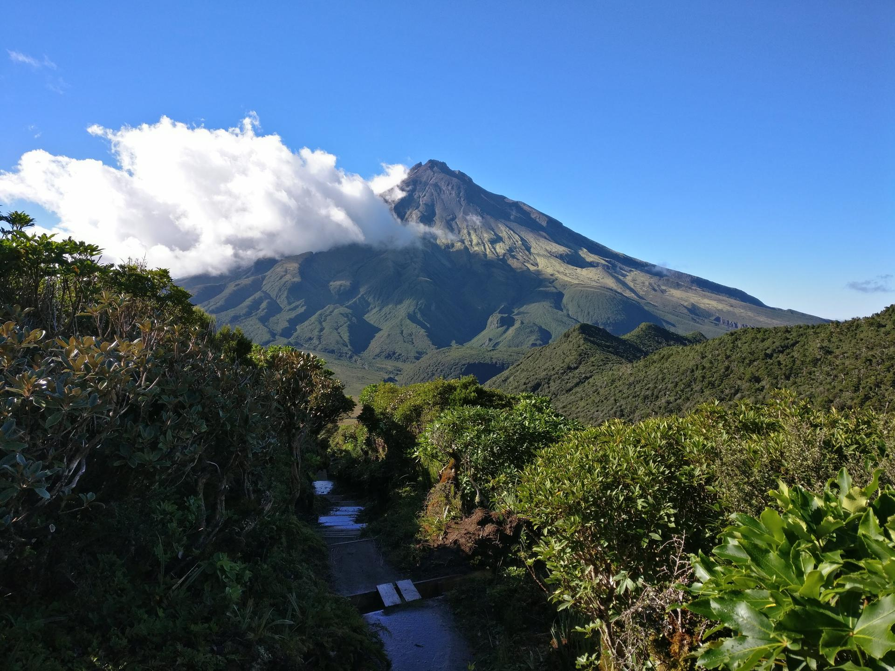
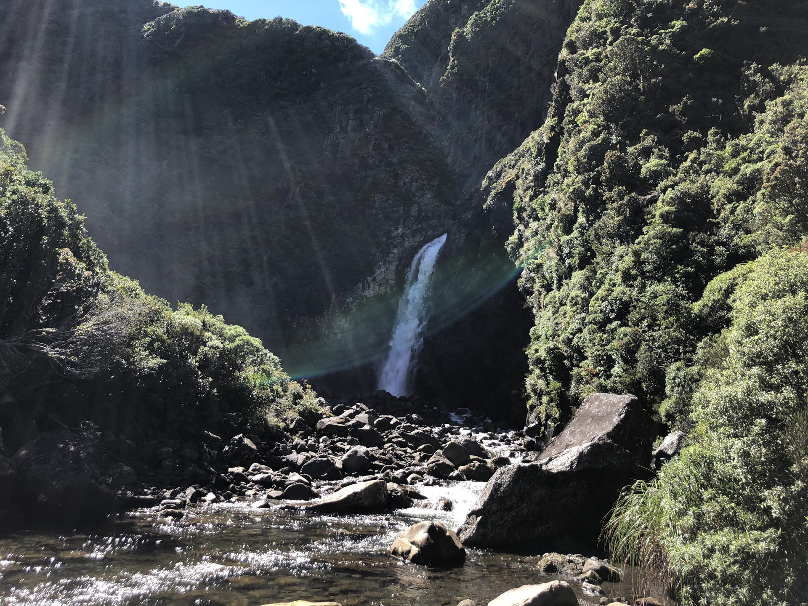

We stopped off in New Plymouth on our way back up to Auckland, near the end of our holiday.
We got there just after some bad weather (ex-cyclone Gita) passed through but luckily we missed the worst of it.
Water restrictions and a boil water notice were in place and Egmont National Park was closed the first day we were there.
Fortunately we were staying in New Plymouth for three days and we decided to wait until our final day to go into the park, hoping the tracks would be in better condition by then.

We had originally planned to do the [Pouakai Circuit](http://www.doc.govt.nz/parks-and-recreation/places-to-go/taranaki/places/egmont-national-park/things-to-do/tracks/pouakai-circuit/) in one day but were worried we would get most of the way round and find the track impassable (there was no information about the state of the tracks so soon after the storm).
To play it safe we decided to do an out and back walk on the Pouakai track, from Mangorei Road trailhead.

We started early, to make the most of the clear weather forecast for the morning, and it was a nice walk up through the forest for the first 90 minutes to Pouakai Hut.
At the junction just after the hut there was a nice view of Mount Taranaki.
From here we did a short out and back to Pouakai Tarn, where the (almost) clear skies and lack of wind resulted in some great photos of the mountain.

We headed back and this time set off towards Holly Hut and Bell Falls.
The track was generally in very good condition and was just a bit boggy in places.
Again, we had great views as we headed down from the Pouakai Track to the Ahukawakawa Swamp.

We made good time getting to Holly Hut and were well on track to get back in time to head up to Raglan at a reasonable time.
From here the track to Bell Falls was a bit more technical in places, including scrambling over some boulders and rocks near the end, and we were moving a bit slower.
The trip to the falls was worth it though and they were very impressive (photos don't do it justice because of the sun).

It was slow going back up to Holly Hut but, after stopping for lunch part way across the swamp, we made really good time back to Mangorei Road.
This was a great walk and we'll be back to do more in the area.


