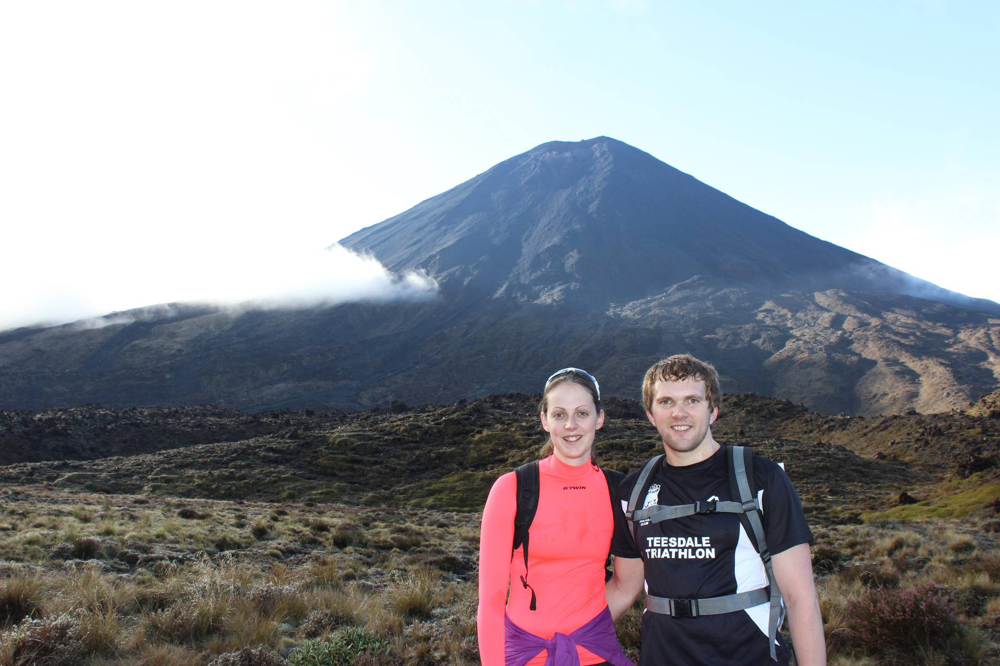
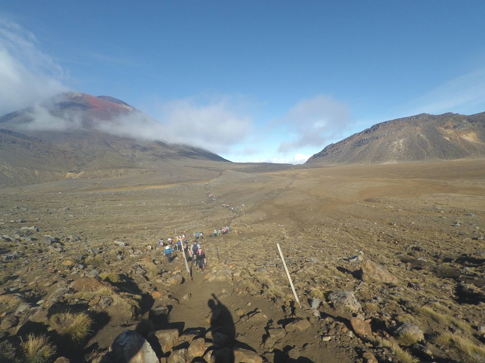
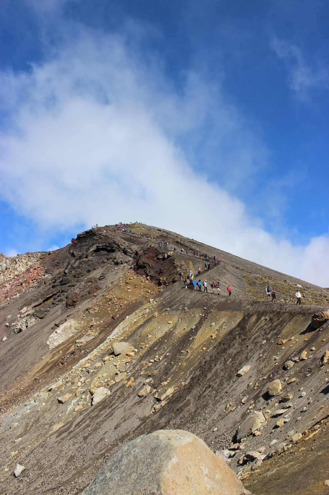
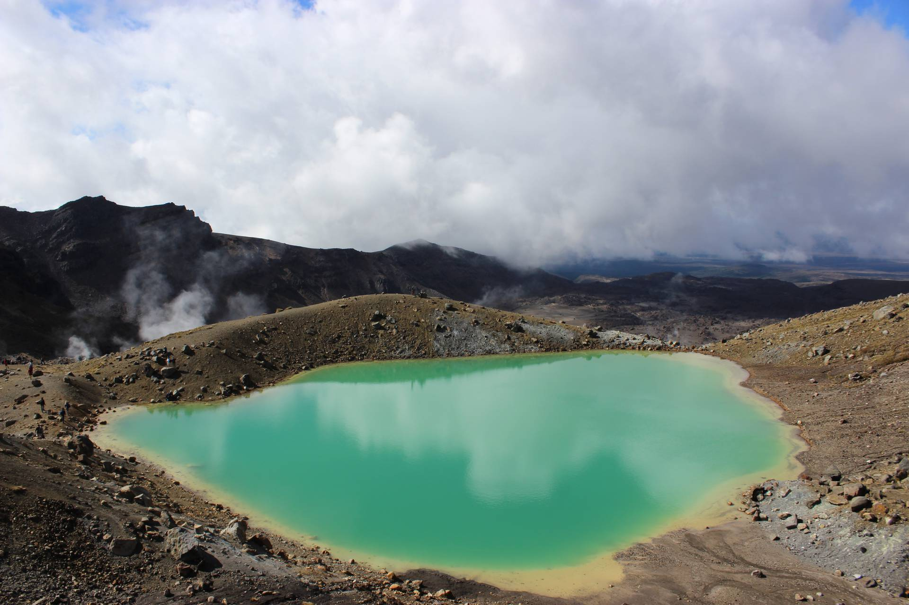

A couple of months after arriving in New Zealand we travelled south to do the [Tongariro Crossing](http://www.tongarirocrossing.org.nz/), supposedly one of the best single day hikes you can do. It was an early start as we had to drop our car off at the finish point and then get a bus to the start. It was very busy due to the good weather and it was also a long weekend.

The walk was amazing, passing by active volcanoes, and the scenery was incredible. We were pretty lucky with the weather although there were some low clouds.

We made it down the narrow, ash covered descent towards the Emerald Lakes and then the long walk down towards the car park at the finish.

