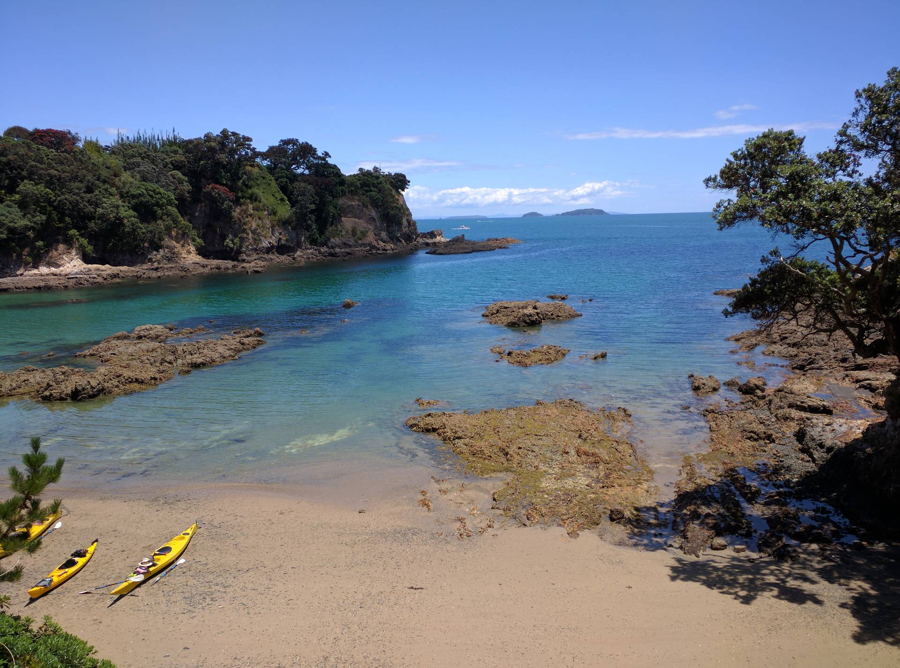
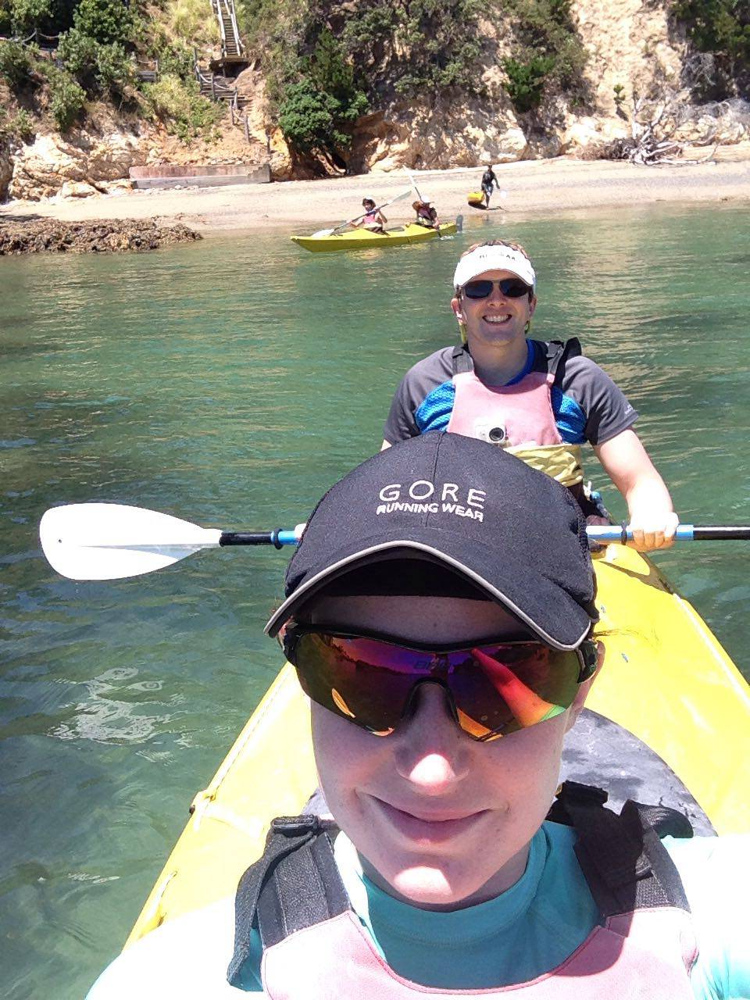

On one of our days off over the Christmas break we headed to Waiheke Island and went on a guided kayak tour with [Kayak Waiheke](http://www.kayakwaiheke.co.nz/). We ended up in a double kayak and there was one other pair on the trip with us. The weather was perfect and there was amazing scenery as we kayaked along the coast. There were some incredible houses on the cliff tops overlooking the sea.

We stopped for lunch on a stunning little beach, which we had to ourselves. There was even time to go for a short swim in the sea before heading back the way we came.

